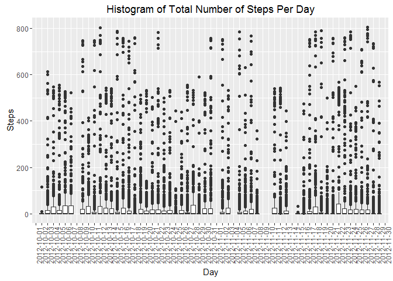
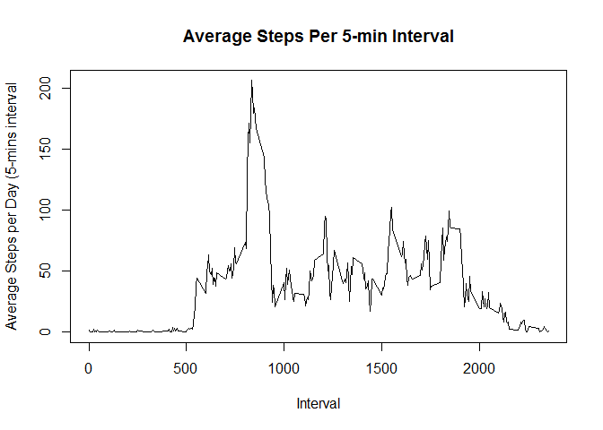
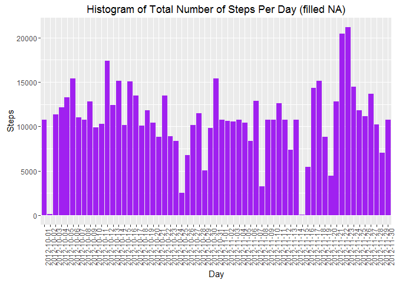
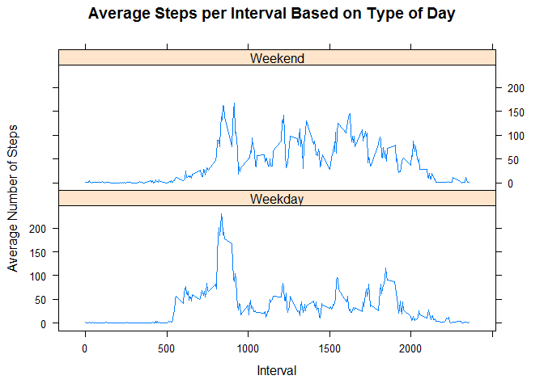

The following codes will:

1.  Loading and preprocessing the data
    1.  It reads the activity.csv file into workspace
    2.  Remove cases with NA

<!-- -->

    activity <- read.csv("activity.csv")        # read csv file
    noNAData <- activity[complete.cases(activity), ]  #drop na 

1.  What is mean total number of steps taken per day?
    1.  compute the total steps made per day
    2.  plot a histogram and boxplot for the total number of steps taken
        each day
    3.  Calculate and report the mean and median of the total number of
        steps taken per day

<!-- -->

    #compute total of steps: 570608
    sum(activity$steps,na.rm=TRUE)        

    ## [1] 570608

    # draw boxplot
    qplot(date, steps, data = activity, geom = "boxplot")+xlab("Day") + ylab("Steps")+ggtitle("Histogram of Total Number of Steps Per Day")+ theme(axis.text.x = element_text(angle = 90, hjust = 1))

    ## Warning: Removed 2304 rows containing non-finite values (stat_boxplot).

    # draw histogram
    ggplot(activity, aes(as.factor(date),steps))+geom_bar(fill="purple", stat="identity")+xlab("Day") + ylab("Steps")+ggtitle("Histogram of Total Number of Steps Per Day")+ theme(axis.text.x = element_text(angle = 90, hjust = 1))

    ## Warning: Removed 2304 rows containing missing values (position_stack).

    # mean no of steps each day: 10766
    as.integer(mean(aggregate(steps~date,activity, FUN=sum)$steps))

    ## [1] 10766

    # mean no of steps each day: 10765
    as.integer(median(aggregate(steps~date,activity, FUN=sum)$steps))

    ## [1] 10765

1.  What is the average daily activity pattern?

<!-- -->

    Q2 <- aggregate(steps~interval, noNAData, FUN=mean)
    plot(Q2$steps ~ Q2$interval, type="l", xlab="Interval", ylab="Average Steps per Day (5-mins interval")
    title(main = "Average Steps Per 5-min Interval")

    # Q2[Q2$steps==max(Q2$steps),]  or use which.max function
    Q2[which.max(Q2$steps),]  # interval when steps is max: 835

    ##     interval    steps
    ## 104      835 206.1698

1.  Imputing missing values

<!-- -->

    #1. the total number of rows with NAs
    sum(is.na(activity))  #2304

    ## [1] 2304

    #2. fil in the missing values with mean for that day
    #3. Create a new dataset that equal to  original dataset but with missing data filled
    fillNA <- activity  #new dataset
    meanInt<- tapply(fillNA$steps, fillNA$interval, mean, na.rm=TRUE, simplify = TRUE)
    nas<- is.na(fillNA$steps)#get position of steps = na
    fillNA$steps[nas] <- meanInt[as.character(fillNA$interval[nas])]

    #4. Draw histogram using dataset without NA records
    ggplot(fillNA, aes(as.factor(date),steps))+geom_bar(fill="purple", stat="identity")+xlab("Day") + ylab("Steps")+ggtitle("Histogram of Total Number of Steps Per Day (filled NA)")+ theme(axis.text.x = element_text(angle = 90, hjust = 1))

    # mean of steps taken per day: 10766
    as.integer(mean(aggregate(steps~date, fillNA, FUN=sum)$steps))

    ## [1] 10766

    # median of steps taken per day: 10766
    as.integer(median(aggregate(steps~date, fillNA, FUN=sum)$steps))

    ## [1] 10766

    # The new mean of the imputed data is 10766 steps compared to the old mean of 10766 steps. There is no difference on average per day.
    # Same explanation for mean

1.  Are there differences in activity patterns between weekdays and
    weekends?

<!-- -->

    #1. Create a new factor variable in the dataset with two levels - "weekday" and "weekend" 
    fillNA<- fillNA%>%
            mutate(weektype= ifelse(weekdays(as.Date(fillNA$date))=="Saturday" | weekdays(as.Date(fillNA$date))=="Sunday", "Weekend", "Weekday"))

    head(fillNA)

    ##       steps       date interval weektype
    ## 1 1.7169811 2012-10-01        0  Weekday
    ## 2 0.3396226 2012-10-01        5  Weekday
    ## 3 0.1320755 2012-10-01       10  Weekday
    ## 4 0.1509434 2012-10-01       15  Weekday
    ## 5 0.0754717 2012-10-01       20  Weekday
    ## 6 2.0943396 2012-10-01       25  Weekday

    #2. Make a panel plot containing a time series plot 
    ## Summarize data by interval and type of day
    dayInt <- ddply(fillNA, .(interval, weektype), summarize, Avg = mean(steps))
    head(dayInt)

    ##   interval weektype        Avg
    ## 1        0  Weekday 2.25115304
    ## 2        0  Weekend 0.21462264
    ## 3        5  Weekday 0.44528302
    ## 4        5  Weekend 0.04245283
    ## 5       10  Weekday 0.17316562
    ## 6       10  Weekend 0.01650943

    xyplot(Avg~interval|weektype, data=dayInt, type="l",  layout = c(1,2),
           main="Average Steps per Interval Based on Type of Day", 
           ylab="Average Number of Steps", xlab="Interval")

    # Answer: there differences in activity patterns between weekdays and weekends.  Weekday # has higher spike in the earlier part of the day. But Weekday has more even spike over
    # the day.
